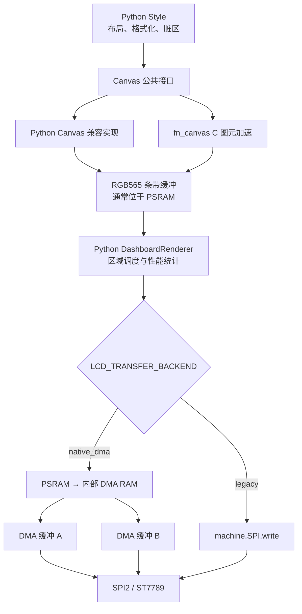

# ESP32-S3 MicroPython LCD DMA 渲染原理

## 1. 设计目标

本方案保持 Python Style 是唯一界面扩展入口。开发者继续使用 `canvas.text()`、
`canvas.fill_rect()`、`canvas.line()` 等接口编写布局，不需要理解 ESP-IDF、DMA
描述符或 ST7789 SPI 事务。

原生代码只负责用户无需感知的像素搬运，不负责布局、数据格式化、脏区选择和
Style 生命周期。这样可以同时满足以下目标：

- 保留 MicroPython 界面开发的简单性。
- 保留现有内置和自定义 Style 的兼容性。
- 避免 PSRAM 缓冲区直接交给 SPI DMA 时的临时复制和频繁分配。
- 避免 Python 渲染线程在每个 SPI 分块完成后重新竞争 GIL。
- 允许通过配置立即切回升级前的标准 `machine.SPI.write()` 路径。

## 2. 分层边界



以下部分继续使用 Python：

- Style 插件发现、加载和切换；
- 数据格式化和显示文本生成；
- 脏区选择；
- Canvas 公共 API；
- 帧和区域调度；
- LCD 初始化、旋转、背光和截图流程。

以下部分由 `fn_lcd` 原生模块完成：

- 分配两块内部 DMA RAM；
- 从 Canvas 像素缓冲分块复制数据；
- 使用现有 `machine.SPI` 的设备句柄排队 DMA 事务；
- 等待事务完成并维护累计字节数与事务数。

## 3. 为什么不把 Style 改成 C

Style 的核心价值是表达界面意图，而不是搬运像素。把 Style 改成 C 会增加编译、
烧录和内存生命周期管理成本，也会破坏运行期插件能力。

当前性能数据中 Canvas 绘制约为几十至一百毫秒，而 LCD 路径曾达到一秒以上。
因此优化边界应停在 Canvas 图元和 LCD 传输后端，不应侵入 Style 层。

## 4. 旧传输路径

`legacy` 后端保留原有代码语义：

```python
self.spi.write(pixels)
```

ESP32 MicroPython 的硬件 SPI 驱动会把较大的缓冲区拆成最多 4092 字节的事务。
等待每笔事务完成时，驱动会释放 GIL；存在两个 Python 线程时，通信线程可能先
获得 GIL，使渲染线程在一次 `show_region()` 内反复等待。当前性能统计包围整个
`show_region()`，所以这些 GIL 等待也会累计到 `LCD_US`。

该路径的价值是兼容标准固件和提供可靠回退，不作为 ESP32-S3 的目标性能路径。

## 5. 原生 DMA 传输路径

`native_dma` 后端初始化两块 4092 字节内部 DMA 缓冲区。4092 与当前
`machine.SPI` 总线默认单笔事务上限一致，不修改屏幕接线和 SPI 时钟。

一次区域写入按以下顺序执行：

1. Python 设置 ST7789 列窗口、行窗口和显存写入命令。
2. Python 拉低 CS，并把同一个 `machine.SPI` 对象和像素缓冲交给 `fn_lcd`。
3. `fn_lcd` 把第一块 PSRAM 数据复制到 DMA 缓冲 A 并排队发送。
4. DMA 发送 A 时，CPU 准备缓冲 B；随后 B 入队。
5. 需要复用 A 时等待其事务完成，然后继续复制下一块。
6. 全部事务完成后返回 Python，Python 拉高 CS。

原生函数执行期间不调用 `MP_THREAD_GIL_EXIT`。这样能够保证一个区域内的 DMA
事务连续完成，不会在每个 4092 字节边界让另一个 Python 线程长期抢占。底层
FreeRTOS、Wi-Fi、USB 和中断任务不依赖 MicroPython GIL，仍可由系统调度。

## 6. 后端开关

`config.py` 提供：

```python
LCD_TRANSFER_BACKEND = "auto"
LCD_DMA_CHUNK_SIZE = 4092
```

支持三种模式：

| 配置 | 行为 | 适用场景 |
| --- | --- | --- |
| `legacy` | 始终使用标准 `machine.SPI.write()` | 对照测试和紧急回退 |
| `native_dma` | 强制使用 `fn_lcd`，模块或内存异常直接报错 | 固件能力验收 |
| `auto` | 优先使用 `fn_lcd`，不可用时回退 `legacy` | 默认部署 |

也可以在设备根目录的 `runtime_config.json` 中覆盖：

```json
{
  "LCD_TRANSFER_BACKEND": "legacy"
}
```

切换后需要软重启，因为 DMA 缓冲和 LCD 设备在启动阶段创建。

`RENDER_SERVICE_THREAD_ENABLED` 与该开关相互独立：前者决定 Python 是否使用渲染
工作线程，后者只决定像素如何写入 SPI。建议先在同步渲染下比较 `legacy` 与
`native_dma`，确认 LCD 传输收益后再单独测试线程模式。

## 7. 启动与性能日志

启动时输出实际后端：

```text
BOOT:LCD_TRANSFER_BACKEND:NATIVE_DMA
```

开发模式帧日志增加：

```text
LCD_BACKEND=NATIVE_DMA
```

`auto` 回退后会显示 `LEGACY`，因此测试时应以日志中的实际值为准，而不是只看
配置文件。

## 8. 推荐对照测试

固定同一块屏幕、同一 Style、同一 Monitor 数据和 40 MHz SPI，分别采集至少
二十个稳定帧：

1. `legacy + SYNC`；
2. `native_dma + SYNC`；
3. `legacy + THREAD`；
4. `native_dma + THREAD`。

记录以下指标的平均值、P95 和最大值：

- `TOTAL`；
- `CANVAS`；
- `LCD`；
- `SCHEDULE`；
- `SLOWEST_REGION`；
- `DROPPED_FRAMES` 的增量。

如果 `native_dma` 生效，预期 `CANVAS` 基本不变，`LCD` 和
`SLOWEST_REGION` 显著下降。若 `LCD` 仍接近一秒，应继续核对实际 SPI 时钟、
供电、接线、区域字节数以及是否发生 `auto` 回退。

## 9. 约束与后续方向

- 当前双缓冲容量受既有 SPI 总线 4092 字节单笔上限约束。
- 原生后端当前同步等待一个区域完成，不是完整的 CPU0 原生渲染任务。
- Style 中大量逐像素 Python 循环仍会反映在 `CANVAS_US`，应优先使用批量 Canvas API。
- 如果后续需要更大的 DMA 事务，应统一调整 SPI 总线 `max_transfer_sz`、内部 RAM
  预算和压力测试，不能只放大 Python 配置值。
- 不计划把 Style 改写为 C；后续优化仍应保持 Python Style API 稳定。

