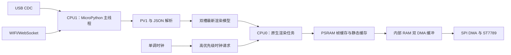

# ESP32-S3 USB/WIFI 接收与双核渲染改造方案

## 1. 文档目标

本文面向 ESP32-S3 N8R8（8 MiB Flash、8 MiB Octal PSRAM）运行方案，目标是在保持 USB 优先、WIFI 自动接管和现有样式插件兼容的前提下，降低通信与 LCD 渲染相互阻塞造成的画面卡顿。

重点目标如下：

- USB/WIFI 接收和协议解析持续高效运行。
- LCD 渲染不再长时间占用通信主循环。
- 充分利用 ESP32-S3 双核、SPI DMA 和 8 MiB PSRAM。
- 时间显示按绝对秒边界稳定推进，降低 `15:57:37` 直接跳到 `15:57:39` 的概率。
- 渲染积压时优先显示最新状态，不回放已经过期的帧。
- RP2040 继续使用原有单循环方案，ESP32-S3 通过板型能力选择优化后端。

## 2. 当前实现分析

当前应用由一个 MicroPython 主循环协作推进以下工作：

1. 轮询 USB CDC 或 WIFI WebSocket。
2. 解析 PV1 和 JSON 数据。
3. 合并系统快照并推进本地时间。
4. 选择样式和脏矩形。
5. 绘制 Canvas 条带。
6. 通过 SPI 将条带写入 ST7789。
7. 每帧完成后执行垃圾回收。

当前方案已经采用接收优先和分片渲染，但仍存在以下抖动来源：

- ESP32-S3 每个主循环渲染批次允许占用约 50 ms，期间 Python 层接收轮询会暂停。
- 默认 `disk` 样式没有差异脏区选择器，只有时间变化时仍会刷新全部动态区域。
- 未收到新数据时使用强制刷新，绕过已有样式的差异脏区选择器。
- 下一次刷新时间按“本次提交时间加一秒”计算，延迟会逐次累积。
- 每帧结束立即执行 `gc.collect()`，垃圾回收停顿可能落在整秒边界附近。
- 渲染器只对快照根字典做浅拷贝，不适合未来直接在线程之间共享可变对象。

## 3. MicroPython 多线程约束

当前 ESP32 固件配置启用了 `MICROPY_PY_THREAD_GIL`。同时，`mpthreadport.c` 使用 `xTaskCreatePinnedToCore(..., MP_TASK_COREID)` 创建所有 MicroPython 线程，而 ESP32-S3 的 `MP_TASK_COREID` 为 CPU1。

因此，仅调用 `_thread.start_new_thread()` 存在以下限制：

- 主线程和渲染线程仍固定在 CPU1。
- Python 字节码受 GIL 约束，Canvas 的 Python 调度不能在两颗核心真正并行。
- 大块 SPI DMA 等待期间驱动会释放 GIL，可以获得一定的接收与写屏重叠，但不能视为完整双核渲染。

结论：Python 渲染线程适合验证任务边界和缓冲区所有权；真正利用另一颗核心，需要 ESP32-S3 专用原生 C 渲染任务。

## 4. 目标架构



### 4.1 CPU1 通信主线程

通信主线程负责：

- USB/WIFI 通道选择、USB 抢占和断线恢复。
- 非阻塞读取、PV1 解包、JSON 解析和命令处理。
- 合并最新系统快照并维护版本号。
- 将不可变的扁平渲染模型发布到双槽邮箱。
- 处理按键、配置、升级、ACK 和性能数据。

通信主线程不直接访问 LCD、SPI、Canvas 和渲染缓冲区。

### 4.2 CPU0 原生渲染任务

原生渲染任务负责：

- 独占 LCD、SPI 和全部渲染状态。
- 执行样式显示命令、脏区合成和 RGB565 输出。
- 使用双 DMA 缓冲重叠“准备下一块”和“发送当前块”。
- 优先处理时钟脏区，在普通区域之间插入最新时钟刷新。
- 统计排队、Canvas、SPI、GC、丢帧和时钟延迟。

CPU0 同时承担 ESP-IDF WIFI 系统任务，渲染任务优先级必须低于 WIFI/LwIP 关键任务，禁止使用无让步的忙循环。

## 5. 时间刷新策略

### 5.1 使用绝对刷新边界

下一次刷新点必须根据校准时钟基准计算：

```text
下一次刷新点 = 校准 ticks + (已经过周期数 + 1) × 刷新周期
```

不能在每次提交后简单使用：

```text
下一次刷新点 = 当前 ticks + 1000 ms
```

绝对边界可以防止一次 30 ms 延迟永久叠加到后续每一秒。

### 5.2 时间区域独立为高优先级脏区

建议将请求划分为三个等级：

1. 时钟或页脚区域：最高显示优先级。
2. 最新系统快照：普通优先级。
3. 全屏刷新、静态背景重建：最低运行优先级。

时钟请求只保留最新一项。渲染任务不得依次回放过期秒数；当前区域或 SPI 事务完成后，应先处理最新时钟区域。

### 5.3 尽量在实际绘制前取时

主线程保存校准时间、校准 `ticks_ms` 和时区后缀。渲染任务在开始绘制时钟区域前计算当前 `HH:MM:SS`，避免队列等待后仍绘制旧时间。

## 6. 队列和缓冲区所有权

### 6.1 固定容量策略

- 系统快照使用两个固定渲染模型槽，采用 `latest wins`。
- 时钟请求使用一个固定槽，新请求覆盖旧请求。
- 样式切换、旋转和截图使用 4 至 8 项不可静默丢弃的控制队列。
- SPI 使用两个固定 DMA 缓冲区。

### 6.2 所有权状态

缓冲区状态统一为：

```text
FREE -> WRITING -> READY -> READING -> FREE
```

锁只保护槽位索引、状态和版本号。禁止在持锁状态下执行 Python 绘制、内存复制、SPI 等待或垃圾回收。

### 6.3 快照发布

线程之间不共享可变 Python 字典。主线程应把样式需要的数据复制到预分配的扁平模型，或编码为原生任务可直接消费的二进制显示命令。

## 7. PSRAM 与内部 RAM 规划

240 × 320 RGB565 完整帧占用 153,600 字节。建议内存规划如下：

| 用途 | 存放位置 | 建议容量 |
| --- | --- | ---: |
| 工作帧缓冲 | PSRAM | 153,600 B |
| 已显示参考帧 | PSRAM | 153,600 B |
| 当前样式静态背景 | PSRAM | 153,600 B |
| 常用样式静态背景缓存 | PSRAM | 0.5～1.5 MiB |
| 字形和文本位图缓存 | PSRAM | 256～512 KiB |
| 双槽渲染模型 | PSRAM | 32～128 KiB |
| USB 环形接收缓冲 | 内部 RAM 或 PSRAM | 64 KiB |
| WIFI 解帧环形缓冲 | PSRAM | 128 KiB |
| SPI DMA 双缓冲 | 内部 DMA RAM | 2 × 16/32 KiB |
| DMA 描述符和任务栈 | 内部 RAM | 按固件实测保留 |

应用主动缓存建议控制在 2～4 MiB PSRAM。空间换时间的重点是保存静态背景、完整帧、字形和预计算结果，不是占满全部 PSRAM。

第一版不直接从普通 MicroPython PSRAM 对象启动 DMA，而是使用“PSRAM 帧缓存 -> 内部 DMA 缓冲 -> SPI”的稳定路径。固件升级或 Flash 写入前必须暂停渲染并排空 DMA，因为 Flash 缓存关闭期间 PSRAM 可能不可访问。

## 8. 分阶段实施计划

### 第一阶段：单循环低风险优化

本阶段不引入线程，先消除已经确认的主要跳秒来源：

1. 为默认 `disk` 样式增加差异脏区选择器。
2. 空闲时钟刷新不再强制刷新全部动态区域。
3. 根据时间校准基准计算下一次绝对刷新点。
4. 将每帧强制 GC 改为带最小间隔和整秒保护窗口的安全 GC。
5. 保留现有接收优先、区域预算和异常回退机制。
6. 补充时钟边界、脏区选择和 GC 调度单元测试。

预期效果：默认样式每秒通常只发送页脚约 11,200 字节。40 MHz SPI 的理论传输时间约 2.24 ms，明显低于完整帧约 30.72 ms 的理论传输时间。

### 第二阶段：建立渲染服务边界

1. 引入 `RenderService` 和固定双槽邮箱。
2. LCD、SPI、Canvas 和样式状态由渲染服务单独持有。
3. 可先通过 Python `_thread` 验证生命周期、覆盖策略和异常恢复。
4. 利用 SPI DMA 等待期间释放 GIL，使通信主线程能够继续运行。

本阶段用于验证架构，不宣称实现 Python 绘制的真正双核并行。

#### 第二阶段实际实现

ESP32-S3 独有代码库已完成以下实现：

- 新增 `render_service.py`，由 `RenderService` 统一代理原有渲染器接口。
- 新增两个固定快照槽，主线程发布前递归复制字典、列表和元组，避免共享可变容器。
- 尚未消费的普通快照采用 `latest wins`，覆盖次数通过 `DROPPED_FRAMES` 上报。
- 新增八项固定控制队列，样式、旋转、背光、截图和渲染中止在渲染所有者线程同步执行。
- `DashboardRenderer`、Canvas、LCD 和 SPI 在工作线程创建或访问，主循环不再直接修改运行期 LCD 状态。
- 工作线程每轮只推进一个区域，以便及时处理控制命令并在 SPI DMA 等待时让通信主线程运行。
- 渲染完成通知携带原始快照版本，避免队列存在待处理帧时 ACK 错报较新的版本号。
- `_thread` 不可用或创建失败时自动建立同步渲染器，保持相同服务接口和现有异常恢复流程。
- 启动日志增加实际渲染模式，开发模式帧 ACK 增加 `RENDER_MODE` 和 `DROPPED_FRAMES`。

第二阶段仍属于 Python 线程架构验证。它能够隔离状态所有权并重叠部分 SPI 等待时间，但不改变 MicroPython GIL 和线程固定 CPU1 的固件约束。

### 第三阶段：ESP32-S3 原生双核渲染

1. 新增 ESP32-S3 用户 C 模块。
2. 使用 `xTaskCreatePinnedToCore()` 将原生渲染任务固定到 CPU0。
3. 实现固定邮箱、双 DMA 缓冲和 PSRAM 能力分配器。
4. 先迁移时钟文字、矩形、位图和 RGB565 复制等热点。
5. 将 Python 样式逐步转换为原生任务可执行的显示命令列表。
6. RP2040 保留现有后端，按板型选择渲染服务。

### 第四阶段：传输缓冲与长期稳定性

1. USB 和 WebSocket 改为预分配环形缓冲。
2. 消除 WebSocket 热路径的 `bytearray` 重建和切片复制。
3. 增加内部 RAM、PSRAM、最大连续块和任务栈余量监控。
4. 完成 USB/WIFI 切换、升级、截图和样式切换压力测试。

## 9. 验收指标

- 连续运行 1 小时，稳定场景下时间不出现加两秒跳变。
- 时钟区域提交相对绝对秒边界：P99 不超过 50 ms，最大不超过 150 ms。
- USB 持续传输时接收轮询间隔：P99 不超过 5 ms，最大不超过 20 ms。
- WIFI 持续传输时接收轮询间隔：P99 不超过 10 ms，最大不超过 30 ms。
- 40 MHz SPI 下时钟区域完整刷新小于 8 ms，全屏像素发送小于 60 ms。
- 连续运行 24 小时无 JSON 丢包、无持续队列增长和非预期 WebSocket 断线。
- WIFI 启用后内部 RAM 最大连续空闲块不少于 64 KiB。
- 性能日志至少包含 `RX_GAP`、`CLOCK_LATE`、`QUEUE_WAIT`、`CANVAS`、`SPI`、`GC` 和 `DROPPED_FRAME`。

## 10. 风险与回退

- 第一阶段只修改调度和脏区规则，可通过恢复原有强制刷新行为快速回退。
- Python `_thread` 不作为最终双核实现，避免依赖实验性线程行为。
- 原生任务不得直接持有未固定生命周期的 Python 对象。
- 样式切换、屏幕旋转和截图必须通过控制队列建立渲染屏障。
- 当原生渲染初始化失败时，应自动回退当前单循环 `DashboardRenderer`。
- 所有新增源码保持 UTF-8 无 BOM，类和方法必须提供规范中文注释。

## 11. 当前实施状态

- [x] 完成现状分析和阶段方案整理。
- [x] 开始实施第一阶段单循环低风险优化。
- [x] 建立 Python 渲染服务边界。
- [ ] 实现 ESP32-S3 原生双核渲染任务。
- [ ] 完成 USB/WIFI 长期压力测试和实机指标验收。
